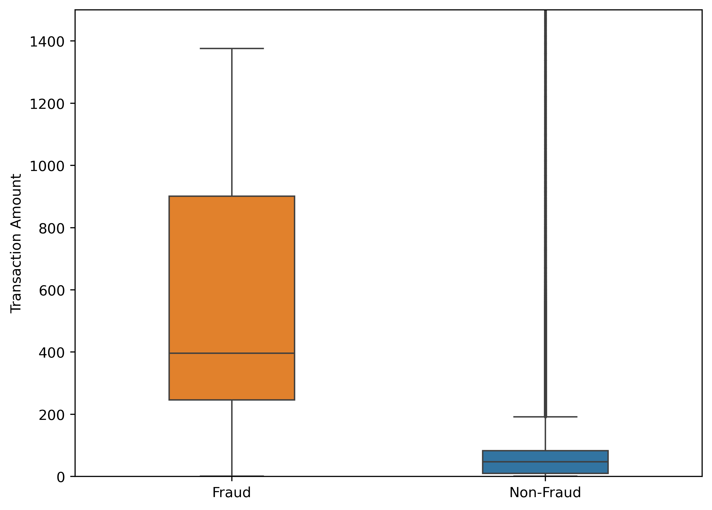
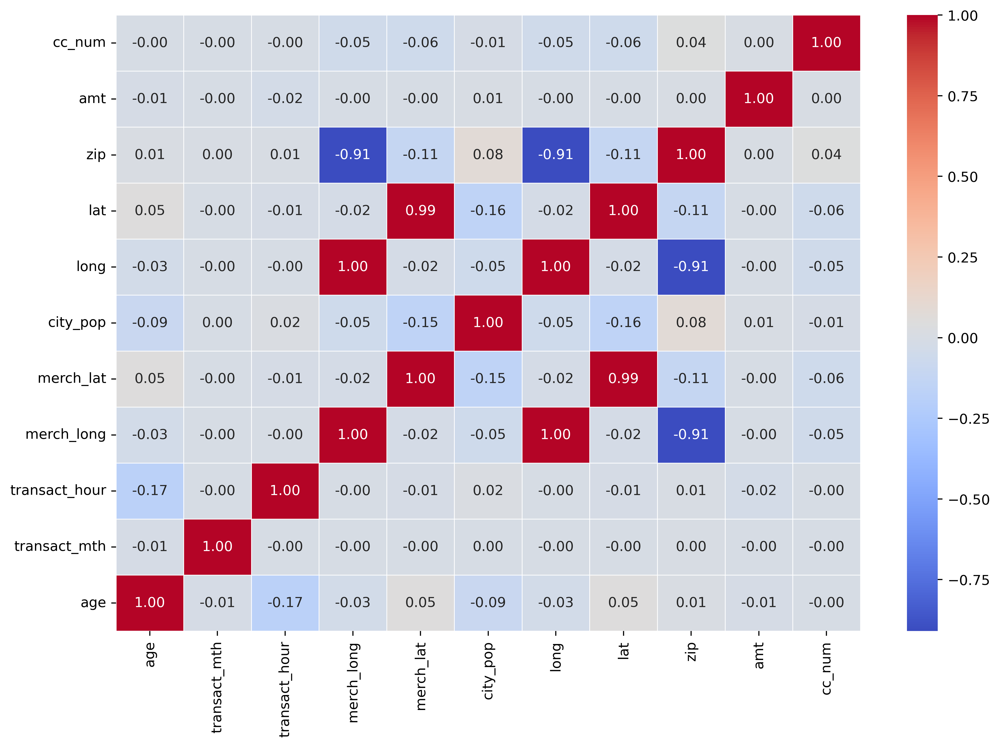
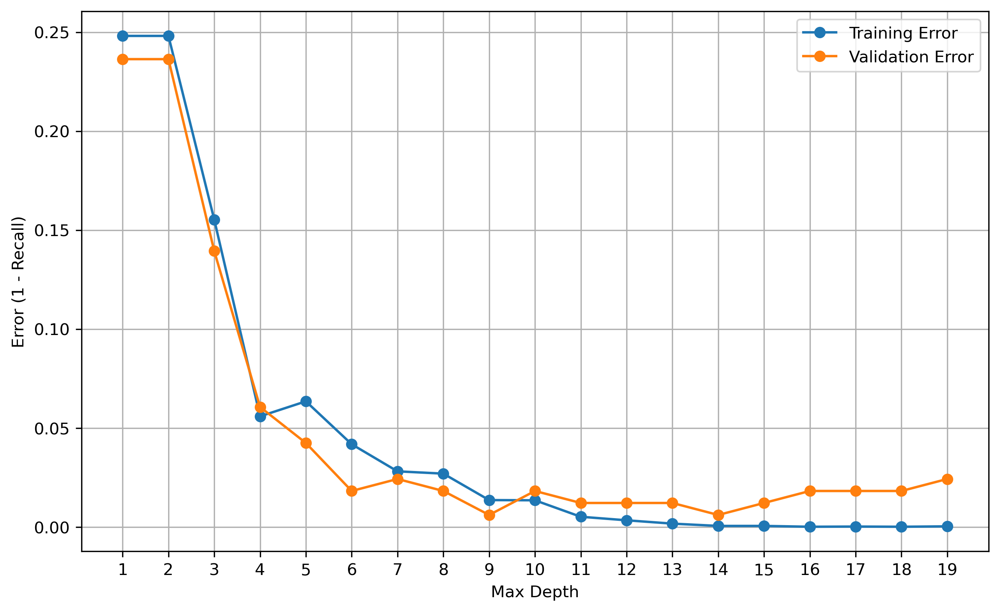
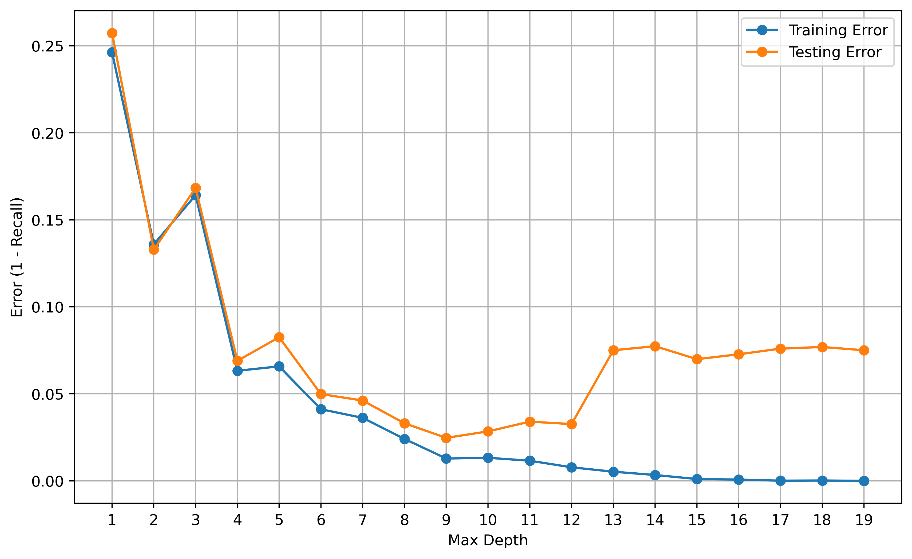
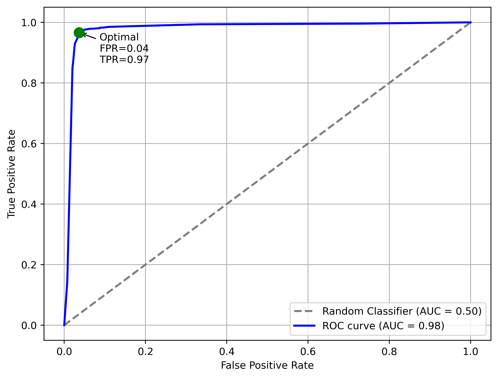
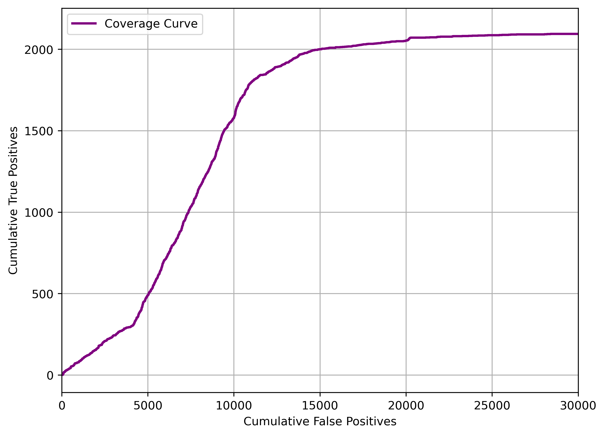
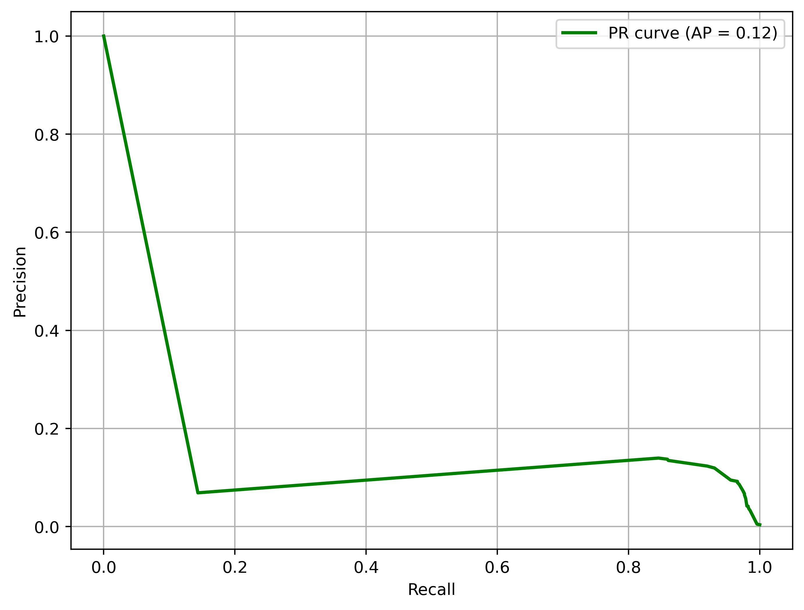
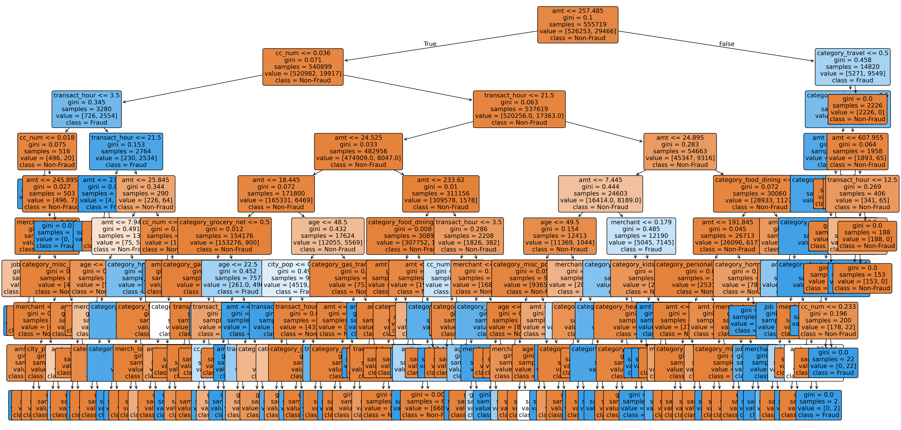
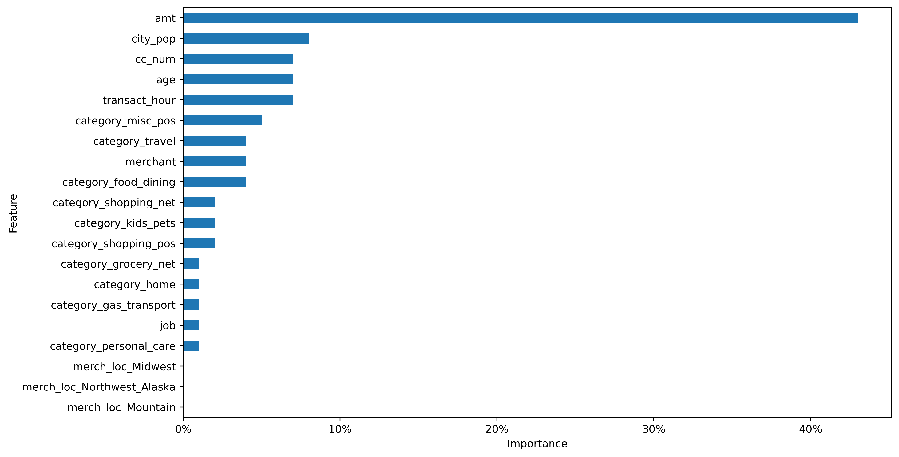

# Fraud Detection — Transaction Classification
  

## Introduction

Fraudulent transactions cause direct financial loss and reputational damage for financial institutions. This project builds a supervised‑learning system to classify transactions as fraudulent or legitimate using publicly available Kaggle datasets (fraudTrain.csv / fraudTest.csv). The work focuses on handling extreme class imbalance, noisy transaction amounts and high‑cardinality geographic data while prioritizing operational constraints (e.g., analyst review workload).

## Idea & Goals

- Detect frauds with high recall (catch as many real frauds as possible) while controlling false positives so that human review effort remains feasible.
- Treat the desired trade‑off as a business constraint: management target ≈ 1 false negative (missed fraud) per 500 false positives (reviews).
- Use resampling (SMOTE oversampling + random undersampling) and validation splits to tune the resampled minority size (treated as a hyperparameter) and model complexity (tree depth).
- Evaluate models using recall and cost‑aware metrics in addition to ROC/AUC and F1.

## Datasets

- Train: ~1.3M transactions (fraudTrain.csv)
- Test: ~555k transactions (fraudTest.csv)
- Dataset available at [Kaggle](https://www.kaggle.com/datasets/kartik2112/fraud-detection/data) (`~200mb`)

## High‑level approach

1. Exploratory data analysis and feature engineering:
   - Create temporal features (hour, month), compute age from DOB, convert lat/long to discrete regions.
   - Normalize high‑cardinality features (percentage encoding for cc_num, merchant) and one‑hot encode categories and regions.
   - Drop personally identifying and highly granular features (street, ZIP, raw lat/long, names).

2. Resampling and validation:
   - Split original training set 70/30 (train/validation).
   - Split the 30% validation into 15 disjoint subsets.
   - For each validation run, apply SMOTE to increase fraud count in the training split (targets from 8,000 to 15,000, step 500), then undersample majority to match.
   - Train Decision Trees with varying max_depth to choose the depth that minimizes the generalization gap (1 − recall).

3. Final training and testing:
   - Select optimal SMOTE target (k = 9,500) and tree depth (max_depth = 9) from validation experiments.
   - Train final Decision Tree on the resampled full training set and evaluate on test set.

## Models evaluated

- Decision Tree (primary; interpretable and fast)
- Random Forest
- Support Vector Machine (linear kernel)
- Logistic Regression
- Neural Network (MLP with multiple hidden layers, LeakyReLU, Adam optimizer)

## Evaluation & cost model

Standard metrics:
- Precision, Recall, F1-score, Accuracy, ROC AUC, PR curve.

Operational cost metric:
- C = (median_fraud_cost × FN) + (review_cost × FP)
  - median_fraud_cost used ≈ \$400 (median fraud transaction)
  - review_cost estimated ≈ \$0.84 per reviewed transaction
- Also use the FN:FP target (1:500) to guide model tuning.

## Key results (summary)

- Decision Tree (SMOTE k=9,500, max_depth=9) gave the best trade‑off for the operational objective — very high recall with manageable FP workload and the lowest misclassification cost among tested models.
- Neural Network achieved similar recall but a higher FP cost.
- Random Forest, SVM and Logistic Regression provided useful baselines but had trade‑offs (training time, FP rate, interpretability).

## Figures (relative links)

- Fraud vs Non‑Fraud amounts:
  

- Correlation heatmap:
  

- Generalization gap (70% train / validation, k=9,500):
  

- Generalization gap (100% train / test):
  

- ROC curve (Decision Tree):
  

- Coverage curve (Decision Tree):
  

- Precision‑Recall curve (Decision Tree):
  

- Decision tree visualization:
  

- Feature importance:
  

## How to run (Windows / VS Code)

1. Create environment and install deps:
   - pip install -r requirements.txt
   - Required packages: pandas, numpy, scikit-learn, imbalanced-learn, matplotlib, seaborn

2. Put datasets in `data/` (fraudTrain.csv, fraudTest.csv).

3. Open `notebooks/fraud_detection.ipynb` in VS Code (or Jupyter) and run cells top-to-bottom.

4. To regenerate saved figures, enable the commented plt.savefig(...) lines in plotting cells and ensure a `figures/` folder exists.

## Next steps / suggestions

- Experiment with boosting (XGBoost / LightGBM) and cost‑sensitive loss functions.
- Add unit tests for preprocessing functions and a small integration test on a sampled subset.

## License & attribution

- Data sourced from [Kaggle](https://www.kaggle.com/datasets/kartik2112/fraud-detection/data) (`~200mb`)
- Code and analysis in this repo; adapt as needed for publication.
